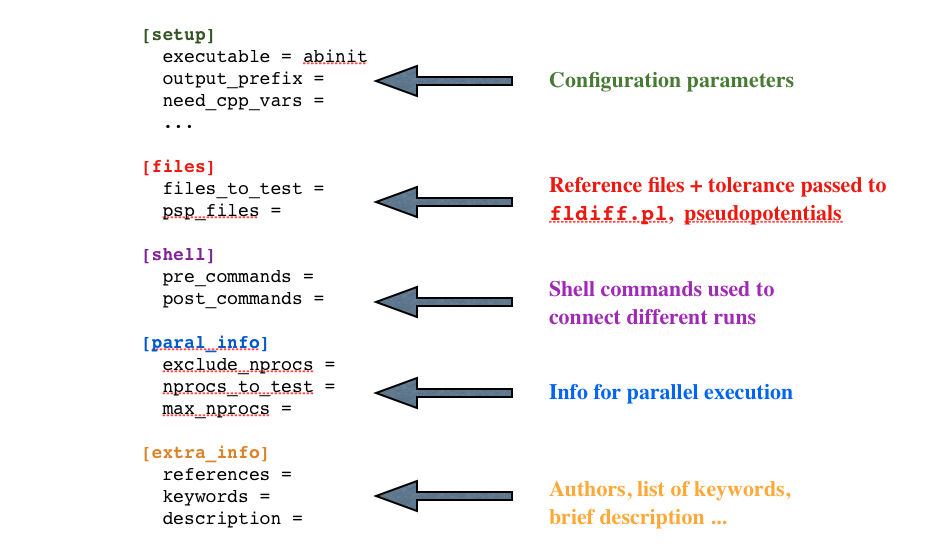
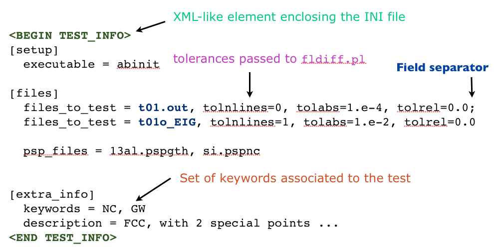
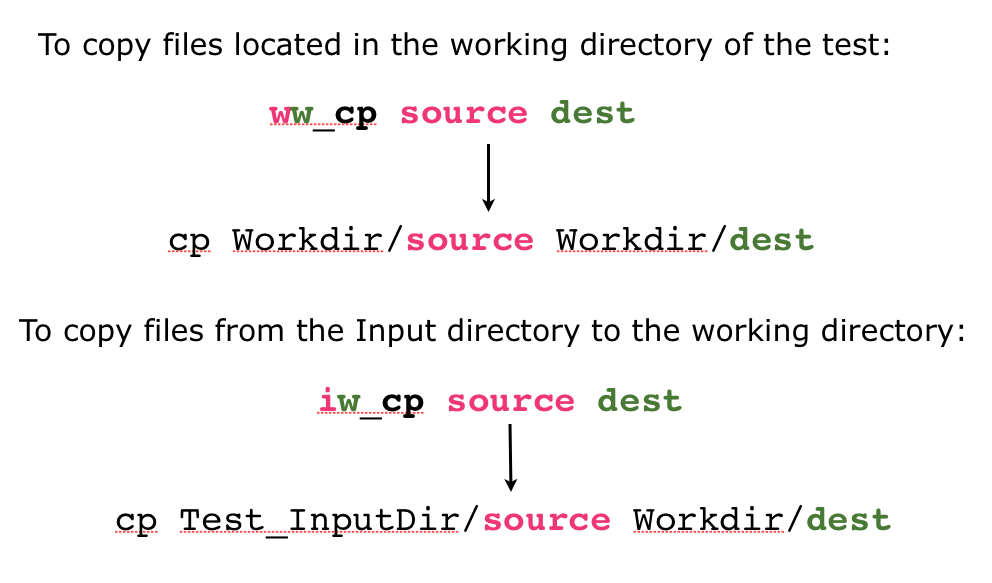
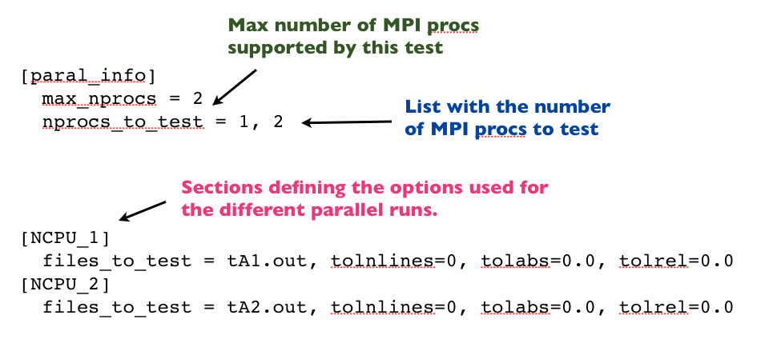

## Design

The ABINIT test suite is a collection of input and output files organized in a hierarchical structure of directories. 
Each directory contains tests sharing some kind of property such as 
the ABINIT major version in which the test was added or the external libraries whose presence 
is required for the execution of the test.

The purpose of the test suite is two-fold: developers use the test farm
to validate their code before pushing their developments to the trunk whereas 
users can use the test suite to validate the executables that will used for their production calculations.

The code that drives the execution of the tests and the validation of the final results 
in mainly written in python (version >= 2.7 is required) and relies on the following principles:

*  Each test is self-describing, in the sense that the input file 
   provides all the information needed to run the test and to analyze the final results.

*  Each test has keywords so that it is possible to 
   select and run only the tests containing these tags. 

*  It should be possible to run the entire suite with MPI/OpenMP and an arbitrary 
   number of processors (not only the tests in the *paral* directory)

*  The execution of the tests can be distributed among python threads in order 
   to reduce the execution time.

## Configuration files

The configuration parameters of the test suite are defined in the `__init__.py`
files located in the test suite directories.
These files are standard python files and the parameters are specified with the standard python syntax.

tests/__init__.py is the top level configuration file.
This file defines the list of directories containing the ABINIT tests:

```python
cat tests/__init__.py

testsuite_dirs = [
  "atompaw",
  "bigdft",
  "built-in",
  "etsf_io",
  "fast",
  #"cpu",  <<< disabled
  ...
]
```

To add a new directory to the test suite, it is sufficient to add its name to the python list.

Each directory listed in `testsuite_dirs` contains an additional `__init__.py` file 
with the list of input files associated to the tests and (optional) global attributes::

```python
cat tests/libxc/__init__.py

# CPP variables 
need_cpp_vars = [
  "HAVE_LIBXC",
]

# List of input files
inp_files = [
"t00.in",
"t01.in",
"t02.in",
"t03.in",
"-t11.in", # Disabled
 ...
]
```

*inp_files* is the list with the names of the input files contained in the Input directory.
One can prepend a dash to the name of file (e.g. “-t11.in”) to signal to the python code 
that this test has been disabled and should not be executed on the test farm.

The variable `need_cpp_vars` is a list of CPP variables that must be defined 
in the include file *config.h* in order to enable the tests in this directory.
In this case, for example, the *libxc* tests are executed only if *HAVE_LIBXC* is defined in *config.h*.
Note that one can prepend the character `!` to the name of the variable to specify that the tests 
should not be executed if the variable is not defined in the build.

Each input file contains all the information needed to run the test and to analyze the 
final results. These meta-variables are gathered in the so-called *TEST_INFO* section.

## Conventions

This paragraph summarizes the conventions used for the names of the tests.
The ABINIT tests are grouped in suites whose name is given by the name of the directory
(as specified in *tests/__init__.py*). 
Each suite can be optionally divided in sub-suites whose names must be registered in *dirname/__init__.py*

!!! important

    The name of the suite/subsuite must be unique. 

To each test is therefore assigned a suite, a sub-suite and an integer number (>= 0) 

The organization in terms of suites/sub-suites allows one to select easily the tests
with the command line interface `runtests.py`.

[](https://asciinema.org/a/40324)

The name of the input file must match one of the two possible regular expressions:

1. `t[integer].in`  e.g. `t11.in`
2. `t[subsuitename]_[integer].in`  e.g. `tgw1_1.in`

The latter syntax is used, for example, in the tutorial directory to 
group the tests associated to a particular lesson.
The name of sub-suite can be passed as argument to *runtests.py* to specify
that only the tests in that particular sub-suite should be executed.

For example, the command:
  
   runtests.py gw1[1:3]

will run the tests *tgw1_1.in*, *tgw1_2.in*.

!!! warning

    Each test has a standard input, a standard output and a standard error 
    whose names are *tgw1_1.stdin*, *tgw1.stdout*, and *tgw1.stderr*, respectively.
    These names are constructed automatically by the python code hence 
    developers should avoid creating similar file names in the Fortran executables at runtime.

## The TEST_INFO section

Each input file contains, in addition to the parameters passed to 
the Fortran code, an additional section (`<TEST_INFO>`) that provides all the 
information needed to run the test and to analyze the final results. 

The `<TEST_INFO>` section is placed at the end of the input file
in order to avoid problems with executables that read from standard input.
The XML-like markers `<BEGIN_TEST_INFO>` and `<END_TEST_INFO>` enclose the section. 
Each line starts with the sentinel `#%%` that will be removed during the parsing. 
What is left is a standard INI configuration file providing all the information 
needed to run the test and to analyze the final results.
The figure below shows how options are grouped in different sections:



A simple example of TEST_INFO section is reported in the figure below:



Note that tokens are separated by a comma (e.g. *tolabs=1.0, tolrel=0.0*), while
fields are separated by a colon

!!! tip
    Use *testlint.py* to validate a new TEST_INFO section

## Important options

This paragraph discusses in more detail the most important options present in the TEST_INFO section.
For the complete documentation of the options, one can execute the script tests/pymods/testsuite.py.

executable
:    the name of the binary file e.g. abinit (mandatory)

max_nprocs 
:    the maximum number of MPI processes that can be used (mandatory)

pre_commands and post_commands ([shell] section)
:    list of shell commands that are executed before and after running
     `executable`. At present only the commands `cp`, `mv`, and `touch` are supported.
     Since the python code uses absolute pathnames to deal with files, one has 
     to specify where the files are located
     (we cannot use relative paths as the python function os.curdir is not thread-safe).

     - i --> input directory
     - p --> Psps_for_tests  
     - w --> Working directory (the directory where the test is executed)
        
     Example: *ww_mv foo bar* corresponds *mv workdir/foo wordir/bar* while
     *iw_cp twan.in wannier.in* corresponds to *cp Input/twan.in workdir/wannier.in*

keywords
:    list of keywords that can be used to select the tests.
     Note that the name of executable is always added to the list 
     of keywords, hence `runtests.py -k cut3d` run all the tests
     associated to the executable `cut3d`

## Chained Tests

In some cases, one has to connect different steps.
A typical case is depicted in the figure below:


In this case, test *t95.in* produces a density file DEN that
is needed to start the second calculation in test *t96.in*.
The python code must be aware of this dependency so that 
*t95.in* and *t96.in* can be executed in the correct order. 

The *TEST_INFO* section defines the option *test_chain*
with the name of the tests forming the chain.
The sequence is ordered in the sense that the python script will
execute the tests starting from the first item of the list.

!!! note

   All the input files belonging to a test chain must contain
   the *test_chain* option (obviously with the same list of tests)

During the execution of a test chain, one usually has to perform basic operations 
such as file renaming or file copying in order to connect the different steps 
(for example, we may want to rename the DEN file produced in *t95.in* so that 
the output density is automatically read in test *t96.in*).
The shell section contains two options that are used to specify the list of 
shell commands that are executed before and after running the test.
A typical example is shown below:


Note that we use a peculiar syntax for the shell commands



## Multi-parallel Tests

A multi-parallel test is a test that can be executed in parallel
with different numbers of MPI processes (e.g. the tests in tests/paral).
The ABINIT test suite is designed so that it is possible to define a single input file
from which multiple parallel tests are automatically generated.
In what follows, we describe how to specify a multi-parallel test in a *TEST_INFO* section. 

The most important option is *nprocs_to_tests* (defined in the `[mpi]` section) 
that lists the number of MPI processes to use for the different tests. 
*max_nprocs* is the maximum number of MPI processes 
that are supported by the calculation (just set it to the maximum value present in *nprocs_to_test*)

Then for each possible number of MPI processes we have a section whose name 
is constructed with the rule: `NCPU_#nproc`.
A simplified example of *TEST_INFO* section for a multi-parallel test is reported below




## A more complicate example: a chain of multi parallel tests

!!! warning

   You cannot change the number of MPI processes inside a test chain


## How to run the tests

The script abinit/tests/runtests.py provides a user-friendly interface
that allows the user to select tests by keywords, authors, suite name, input variables etc. 
It also provides options for controlling the number of MPI processes, 
the number of OpenMP threads and the number of python threads (task parallelism).

The syntax is:

    runtests.py [suite_args] [options]. 

where `suite_args` is a list of suite names that can be optionally selected (sliced) using python syntax

For example:

    runtests v3[:4] v4[45:] v5[3] 

execute all the tests in *v3* from 0 up to 4 (excluded), all the tests in *v4* starting from 45 and *v5/t3*

!!! warning

    If *suite_args* is not given, the script will execute the entire list of tests.

The most useful options are:

-j
: specifies the number of python threads (task parallelism)

-n
: specifies the number of MPI nodes

-o
: specifies the number of OMP threads

-k
: selects tests by keywords

-h
: for help + list of examples

!!! tip

    For the complete list of options supported, use `runtests -h`

## How to run tests with MPI

In the simplest case, one can run MPI tests by just using:

    runtests.py -n 2 paral

where *n* specifies the number of MPI processes.
*runtests.py* employs very simple rules for guessing the MPI implementation that must be invoked. 
In particular, it assumes that:

1. The environment is properly setup (*PATH*, *LD_LIBRARY_PATH*)

2. MPI Demons (e.g. mpd) are already running in the background 
   (you have to initialize the demon manually before launching the tests)

3. It uses the mpiruner in *PATH* (default: mpirun) and assumes 
   the standard syntax for specifying the number of processors 
   (i.e. mpirun -n 4 exe < stdin > stdout)

If you need to override the default setting, you can pass options to the script
via a configuration file in the INI format (-c options):

    runtests.py -n 2 -c mpi.cfg

    $ cat mpi.cfg

        [mpi]
          mpi_prefix = /usr/local/openmpi-gcc47/
          mpirun_np = %(mpi_prefix)s/bin/mpirun -np

*mpirun_np* is the string with the path to the mpirunner, followed by any additional option you may want
to use. The option used to specifying the number of MPI nodes that must be added at the end of the string.

!!! tip

    For more examples, consult the configuration files in abinit/tests/mpi_cfg.

## How to run testbot.py on a buildbot slave 

This section is intended for developers who might want to run interactively 
the entire test suite on a slave builder (example: one or more tests 
are failing on a slave. You have already modified the source code to fix the problem
and you want avoid to launch a full buildbot build just to check that your changes are OK)

In this case, one can re-rerun the entire test suite (or part of it) by just executing the following two steps

    cd abinit/tests
    testbot.py

The script `testbot.py` reads the configuration file `testbot.cfg` (already present in the working directory), 
runs the entires set of tests and produces the final report.

Note that one modify the configuration options defined in `testbot.cfg` in order to speed-up the execution of the tests.
In particular one can use the options:

    # with_tdirs = list of directories to execute
    # without_tdirs = list of directories that will be excluded

## How to add a new test

Let's assume you want to add a new test `tfoo_1.in` to the directory `v5`.
This test will be hence located in the `foo` sub-suite within suite `v5` 
so that we can easily run it with `runtests`:
    
    runtests foo[1] 

In order to add the new test, one has to follow the following steps:

1. Add the name of the input file to the `inp_files` list in `v5/__init__.py`

2. Register the name of the sub-suite to the list sub-suites 
   defined in `v5/__init__.py` 
   (this step can be skipped if the test does not belong to a sub-suite)

3. Add the input files to *v5/Input* and the reference files to *v5/Refs*

!! warning

       The code uses a pickle file (*test_suite.cpkl*) to store the set of objects
       representing the tests of the test suite.
       Remember to regenerate the database after any change to the TEST_INFO section
       or any modification of the configuration parameters of the test suite (*__init__.py* files).
       *runtests.py* provides the handy option -r (regenerate) to automatically regenerate the database
       before running the tests.

## How to add a chain of tests

TODO

## How to add a parallel test
TODO

## How to add support for a new executable

Let's assume that you have a new executable named *foo.x*
and you want to change the python code so that the results of foo.x are automatically tested.
What are the modifications needed to integrate foo.x in the ABINIT test suite?

First you have to provide an input file for foo.x with a
`<TEST_INFO>` section that provides ALL the information needed to run the executable. 
If foo.x requires some kind of input data or extra rules that are not supported, 
you will have to modify the parser so that the new options are stored in *BaseTest*.

Then you have to tell the code how to construct the standard input that will be passed to foo.x. 
This is the most complicated part as it requires some understanding of the internal implementation.

The code uses three different objects:
 
1. BaseTest
2. ChainOfTests
3. TestSuite

to represent the tests of the testsuite.

*BaseTest* is the base class that provides methods to run and analyze the results
of the test (you should try to reuse this piece of code as much as possible).

*ChainOfTests* is a list of BaseTest instances that cannot be executed separately. 
Typical example: t1.in produces an output result that is used as the input of tests *t2.in*.

*TestSuite* is a list of (*BaseTest*, *ChainOfTests*) instances and provides
user-friendly methods to extract tests according to some rule (e.g. keywords) 
and to run these tests with Python threads.

The *BaseTest* class provides the *make_stdin* method that returns 
a string with the standard input that should be passed to the Fortran executable.
Since each executable has its own format for the input file, the *BaseTest* is not able to handle all the different cases.
Hopefully, you only have to replace the *make_stdin* method of *BaseTest*
so that the appropriate standard input is constructed from the values specified in the `<TEST_INFO>` section.  
