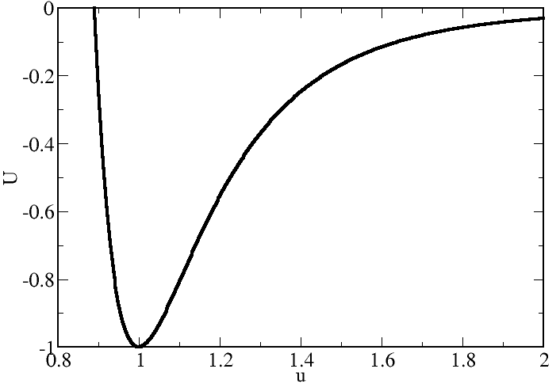
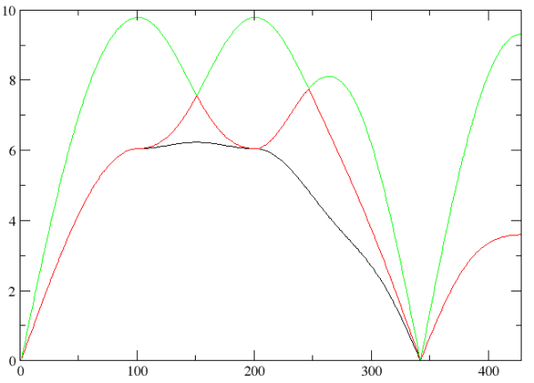
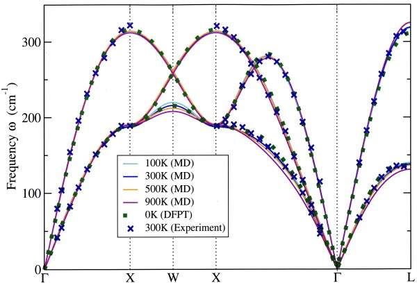

# First tutorial on aTDEP



## The 2$^{nd}$ order **effective** Interatomic Force Constants (IFC)

This tutorial shows how to capture anharmonicities by means of an harmonic **Temperature Dependent Effective Potential** (TDEP) by using the ABINIT package. In practice, this requires to obtain the $2^{nd}$ order **effective** IFC. Once obtained, almost all the dynamic (phonons...), elastic (constants, moduli...) and thermodynamic (entropy, free energy...) desired quantities can be derived therefrom.

You will learn:

1. how to launch aTDEP just after an ABINIT simulation, 
2. the meaning and effects of the main input variables, and 
3. how to exploit the data provided in the output files.

You are not supposed to know how to use ABINIT, but you are strongly encouraged to read the following documents:

* User guide: [[pdf:aTDEP_Guide| aTDEP guide]]  
* Theory: [[pdf:aTDEP_Paper|aTDEP paper]] corresponding to the article [[cite:Bottin2020]]

This tutorial should take about 1.5 hour.

[TUTORIAL_READMEV9]

## 1. Summary of the aTDEP method

The **Temperature Dependent Effective Potential** approach has been introduced by O. Hellman *et al.* [[cite:Hellman2011]] in 2011. The purpose of this method is to capture the anharmonic effects in an **effective** way. 

Let us consider that the potential energy $U$ of a crystal can be rewritten as a Taylor expansion around the equilibrium:

$$
U=   U_0 + \sum_{p\ge 1} \frac{1}{p\ !} \sum_{\substack{\alpha_1...\alpha_p \\ i_1...i_p}}\overset{(p)}{\Phi}\vphantom{\Phi}_{i_1...i_p}^{\alpha_1...\alpha_p}\prod_{k=1}^p u_{i_k}^{\alpha_k}
$$

> In this equation, and in the following, the Latin letters in subscripts $i, j, k...$ and the Greek letters in superscripts $\alpha, \beta, \gamma$... will define the atoms and the cartesian directions, respectively.

with U$_0$ the minimum of the potential energy, $u$ the displacement with respect to equilibrium, and $\overset{(p)}{\Phi}$ the $p^{th}$ order IFC, respectively. The aim of the TDEP method is to extract the IFC in an effective way. 

Now, let us assume that :

1. the previous equation is truncated at the $2^{nd}$ order such as : 
$$
U=   U_0 + \frac{1}{2!}\sum_{ij,\alpha\beta} \overset{(2)}{\Theta}\vphantom{\Theta}_{ij}^{\alpha\beta} u_i^\alpha u_j^\beta + 0(u^3)
$$

2. a set of $N_t$ forces $\mathbf{F}_{AIMD}(t)$ and displacements $\mathbf{u}_{AIMD}(t)$ is obtained using *ab initio* molecular dynamic (AIMD) simulations, leading to the following system of equations ($F=-\nabla U$): 

$$
F_{i,AIMD}^\alpha(t)=  - \sum_{j,\beta} \overset{(2)}{\Theta}\vphantom{\Theta}_{ij}^{\alpha\beta} u_{j,AIMD}^\beta(t)
$$

It is then possible to obtain the 2nd order **effective** IFC $\overset{(2)}{\Theta}$ by using a least squares method : $\overset{(2)}{\Theta} = \mathbf{F} . \mathbf{u}^{-1}$. This fitting procedure modifies the 2nd order IFC by including (in an effective way) the anharmonic contributions coming from the terms above the truncation. Therefore, the IFC are no longer constant and become temperature dependent. That is the reason why we change the notation: in the following, the $\Phi$ will be referred to as the ‘‘true IFC’’ and the $\Theta$ as the ‘‘effective IFC’’.


## 2. A simple case : Al-fcc

Let us begin with the face centered cubic (fcc) phase of aluminum. This one is very simple for many reasons : 

- There is only one atom in the unitcell so we will have only three phonon branches in the spectrum.
- At 0 GPa, the fcc phase is stable from 0 K up to the melting so we do not expect any trouble coming from phonon instabilities.

*Before beginning, you might consider to work in a different subdirectory as for the other tutorials. Why not create Work_atdep1 in \$ABI_TESTS/tutoatdep/Input? You can copy all the input files within.*

```sh
cd $ABI_TESTS/tutoatdep/Input
mkdir Work_atdep1
cd Work_atdep1
cp ../tatdep1_1.* . 
```

### 	2.1 The input files

Let us discuss the meaning of these five files :

1. The data files *tatdep1_1xred.dat*, *tatdep1_1fcart.dat* and *tatdep1_1etotal.dat* :

These ones store some data coming from the AIMD simulations : the reduced coordinates, the cartesian forces and the total energy of all the atoms in the supercell, respectively. In the present example, only 20 snapshots are extracted from a very long trajectory with thousands molecular dynamic time steps.

2. The input file *tatdep1_1.abi* :



This one lists (in a formated way) all the input variables needed. In the following we will comment each variable and the value used for the present calculation. Many of them have the same meaning as in the ABINIT main code.

- For the unitcell :

Input variable | Meaning
---------------|--------
[[atdep:brav]] | Defines the BRAVais lattice (as defined in the ABINIT code). For the present calculation (fcc) : 7 (cubic) and -3 (face centered).
[[atdep:natom_unitcell]] | Defines the Number of ATOMs in the UNITCELL. For the present calculation : 1 
[[atdep:xred_unitcell]] | Defines the Xyz REDuced coordinates in the UNITCELL. For the present calculation : 0.0 0.0 0.0
[[atdep:typat_unitcell]] | Defines the TYPes of AToms in the UNITCELL. For the present calculation : 1
[[atdep:ntypat]] | Defines the Number of TYPes of AToms. For the present calculation : 1
[[atdep:amu]] | Defines the Atomic masses in Mass Units. For the present calculation (Al) : 26.981539

- For the supercell :

Input variable | Meaning
---------------|--------
[[atdep:rprimd]] | Defines the Dimensional Real space PRMitive vectors of the SUPERCELL. For the present calculation : $\begin{pmatrix} 22.9089998 & 0.0 & 0.0 \\ 0.0 & 22.9089998 & 0.0 \\ 0.0 & 0.0 & 22.9089998 \end{pmatrix}$ 
[[atdep:multiplicity]] | Defines the MULTIPLICITY of the SUPERCELL with respect to the primitive UNICELL. For the present calculation : $\begin{pmatrix} -3 & 3 & 3 \\ 3 & -3 & 3 \\ 3 & 3 & -3 \end{pmatrix}$
[[atdep:natom]] | Defines the Number of ATOMs in the SUPERCELL. For the present calculation : 108
[[atdep:typat]] | Defines the TYPe of AToms in the SUPERCELL. For the present calculation : 108 * 1
[[atdep:temperature]] | Defines the TEMPERATURE of the system. For the present calculation : 900 K

- For the calculation :

Input variable | Meaning
---------------|--------
[[atdep:nstep_max]] | Defines the upper limit in the range of configurations that one wants to use. For the present calculation : 20
[[atdep:nstep_min]] | Defines the lower limit in the range of configurations that one wants to use. For the present calculation : 1
[[atdep:rcut]] | Defines the CUToff Radius used to compute the second order IFCs. For the present calculation : 11.45 ($\approx \frac{22.9089998}{2}$) 

- Optional :

Input variable | Meaning
---------------|--------
[[atdep:enunit]] | Defines the ENergy UNIT used for the phonon spectrum. For the present calculation : 3 (in THz)

3. The files file *tatdep1_1.files* lists the input file name and the root of input and output files :



You can now execute `atdep`:

```sh
atdep < tatdep1_1.files > log 2> err &
```

The code should run very quickly.

### 	2.2 The output files

The ATDEP code writes **many** output files (some of them are available in *$ABI_TESTS/tutoatdep/Refs/). The reason is twofold : to remove all the "details" of the calculations from the main output file and to give all the thermodynamic data in an handable format. Let us detail these output files in the following :

#### 		2.2.1 The main output file *tatdep1_1.abo* :



This file reproduces all the steps encountered during the execution of ATDEP. You are strongly adviced to detect all the following sequences in the main output file :

1. begins with the common header of the ABINIT output files
2. echoes all the input variables included in the input file
3. computes some quantities using the available data (the acell of the unitcell,...)
4. generates the **q**-point mesh
5. establishes a correspondence between the atoms in the unitcell, the multiplicity, the symmetries and the atoms in the supercell
6. finds the symmetry operations between atoms and pairs of atoms.
7. computes the number of non-zero independent IFC coefficients at the 1st and 2nd order, for each shell of coordination.
8. computes the constraints (for the IFC), builds the pseudo-inverse and solves the problem
9. lists all the IFC coefficients for each shell, at the 1st and 2nd order
10. writes in some files the dynamical matrix, the phonon spectrum and the vibrational density of states (vDOS)
11. echoes the elastic constants and some elastic moduli
12. computes the energy of the model (the temperature effective potential) and some convergence parameters
13. writes in a file the thermodynamics of the system (see below)
14. finishes with the standard aknowlegment section of ABINIT output files 

* The phonon frequencies file *tatdep1_1omega.dat* :



You can plot the phonon spectrum. If you use the |xmgrace| tool, launch:

      xmgrace -nxy tatdep1_1omega.dat

You should get this picture :



On the Y-axis, you have the frequencies (in THz, see the input file). On the X-axis, you have the **q**-points along a path in the Brillouin Zone (BZ). This one is defined by default and depends on the Bravais lattice.

!!! note
    The path along the BZ can be changed using the [[atdep:bzpath]] input variable. 

The BZ boundaries and all the **q**-points included in the path are available in the *tatdep1_1qpt.dat* file :



As you can see, in the present calculation the path is as follows : $\Gamma$ - X - W - X' - K - $\Gamma$ - L. Concerning the results, you can compare the phonon spectrum obtained in this tutorial with the first figure of [this paper](https://journals.aps.org/prl/abstract/10.1103/PhysRevLett.91.135501). As you can see, the overall agreement is very good but not perfect due the too small number of configurations (20 time steps) and the difference between the experimental (80 K) and theoretical (900 K) temperatures. If you perform AIMD simulations at various temperatures and store more than 20 uncorrelated configurations, you will obtain the following picture : 



!!! warning 
    The *tatdep1_1qpt.dat* file do not be confused with the *tatdep1_1qbz.dat* file which defines the Monkhorst-Pack **q**-point mesh used to compute the vDOS : $g(\omega)=\frac{1}{3N_a}\sum_{s=1}^{3N_a}\sum_{\mathbf{q}\in BZ} \delta(\omega-\omega_s(\mathbf{q}))$ such as $\int_0^{\omega_{max}} g(\omega)d\omega =1$, with $\omega_{max}$ the highest phonon frequency of the system. The vDOS is written in the *tatdep1_1vdos.dat* file. You may plot it to verify that the vDOS is consistent with the phonon spectrum.


#### 		2.2.2 The thermodynamic file *tatdep1_1thermo.dat* :



In this file, we print all the thermodynamic data that we can compute by using the phonon spectrum and/or the vDOS. The main quantity is the free energy. This one can be splitted in two parts:

$$
\mathcal{F}(V,T)=U_0(V)+\mathcal{F}_{\rm vib}(V,T) 
$$

The first part is the cold contribution (at T = 0 K) whereas the second one is the vibrational contribution (with T $\neq$ 0). The cold contribution can be computed using a dedicated calculation or using the following formulation :

$$
U_0(V)=< U_{\rm MD}(t)-\frac{1}{2!}\sum_{ij,\alpha\beta} \overset{(2)}{\Theta}\vphantom{\Theta}_{ij}^{\alpha\beta} u_i^\alpha u_j^\beta >
$$

The vibrational contributions (free energy $F_{\rm vib}$, internal energy $U_{\rm vib}$, entropy $S_{\rm vib}$ and heat capacity $C_{\rm vib,V}$) can be computed using the vDOS $g(\omega)$ in the harmonic approximation (see the paper of Lee & Gonze [[cite:Lee1995]]) :

$$
  F_{\rm vib} = \frac{3N_a}{\beta} \int_0^{\omega_{max}} \ln \left(2\sinh(\frac{\beta\hbar\omega}{2})\right) g(\omega)d\omega \label{eq:Fvib}
$$

$$
  U_{\rm vib} = 3N_a \int_0^{\omega_{max}} \frac{\hbar\omega}{2}\coth(\frac{\beta\hbar\omega}{2}) g(\omega)d\omega 
$$

$$
C_{\rm vib,V} = 3N_a k_B \int_0^{\omega_{max}} \left(\frac{\beta\hbar\omega}{2\sinh(\frac{\beta\hbar\omega}{2})}\right)^2 g(\omega)d\omega \label{eq:Cv}
$$

$$
  S_{\rm vib} = 3N_a k_B \int_0^{\omega_{max}} \left[\frac{\beta\hbar\omega}{2}\coth(\frac{\beta\hbar\omega}{2}) - \ln \left(2\sinh(\frac{\beta\hbar\omega}{2})\right)\right] g(\omega)d\omega
$$

All these thermodynamic data are computed and written in the *tatdep1_1thermo.dat*. Note that this file is splitted in two parts :
 
- the first one is dedicated to these data obtained at the temperature defined by [[atdep:temperature]].
- whereas in the second one, these data are extrapolated at all the temperatures using a fixed vDOS.

!!! note
    This last point corresponds to the harmonic approximation (HA). In this case, the phonon frequencies (so, the vDOS) do not depend on the temperature : $\omega_{HA} = \omega(V)$. Using HA, it's then possible to compute all the thermodynamic data, whathever the temperature, since the vDOS remains constant. In this case, the temperature variation of the thermodynamic quantity only comes from the filling of phononic states by the Bose-Einstein statistics. To go beyond, and capture the thermal expansion for example, we can assume that the temperature effects are **implicit** through the variation of the volume. It is the quasi-harmonic approximations (QHA) : $\omega_{QHA}=\omega(V(T))$. If in many cases the QHA gives excellent results, it fails to reproduce an **explicit** variation of the thermodynamic data with respect to the temperature (the phonon frequencies cannot vary at constant volume, along an isochore). This **explicit** variation comes from the anharmonic effects and we have $\omega_{Anh}=\omega(T,V(T)$.


### 	2.3 The convergency with respect to some input variables

1. The cutoff radius

2. The number of configurations

3. Other parameters

- **k**-points

## 3. Two atoms in the unitcell : Si-d

This calculation is similar to the one performed in the following article [[cite:Bottin2020]].

###	3.1 Convergence with respect to Rcut

###	3.2 Effect of the number of configurations

###	3.3 Another question?


## 4. Temperature dependency of a soft mode : U-$\alpha$

This calculation is similar to the one performed in the following article [[cite:Bouchet2015]].

###	4.1 Convergence with respect to Rcut

###	4.2 Another question?

## 5. Dynamic stabilization due to anharmonic effects : Zr-$\beta$

This calculation is similar to the ones performed in the following articles [[cite:Anzellini2020]] and [[cite:Bottin2020]].

###	4.1 Convergence with respect to Rcut

###	4.2 Another question?

## 6. Description of an alloy using VCA : UMo-$\gamma$

This calculation is similar to the one performed in the following article [[cite:Castellano2020]].

###	4.1 Convergence with respect to Rcut

###	4.2 Another question?


