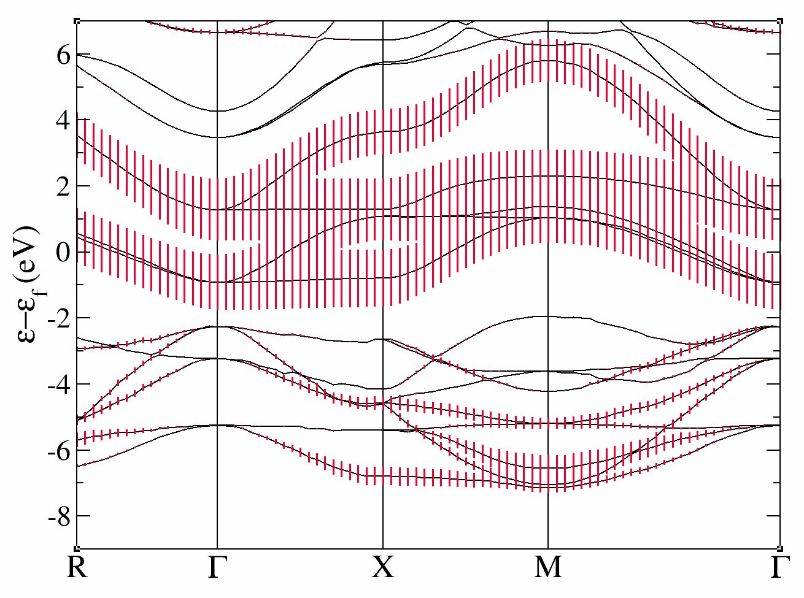
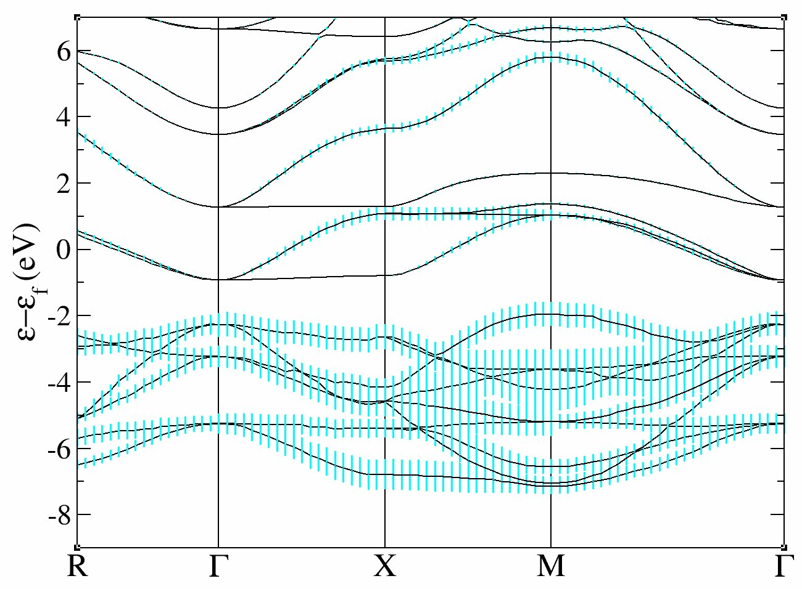
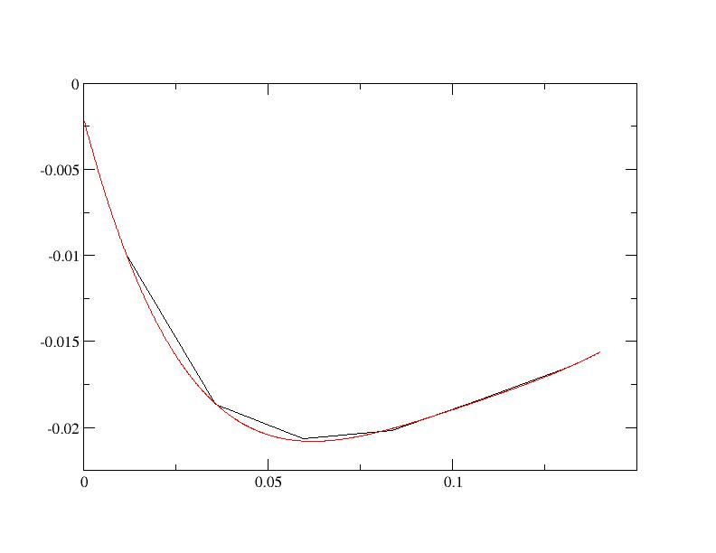
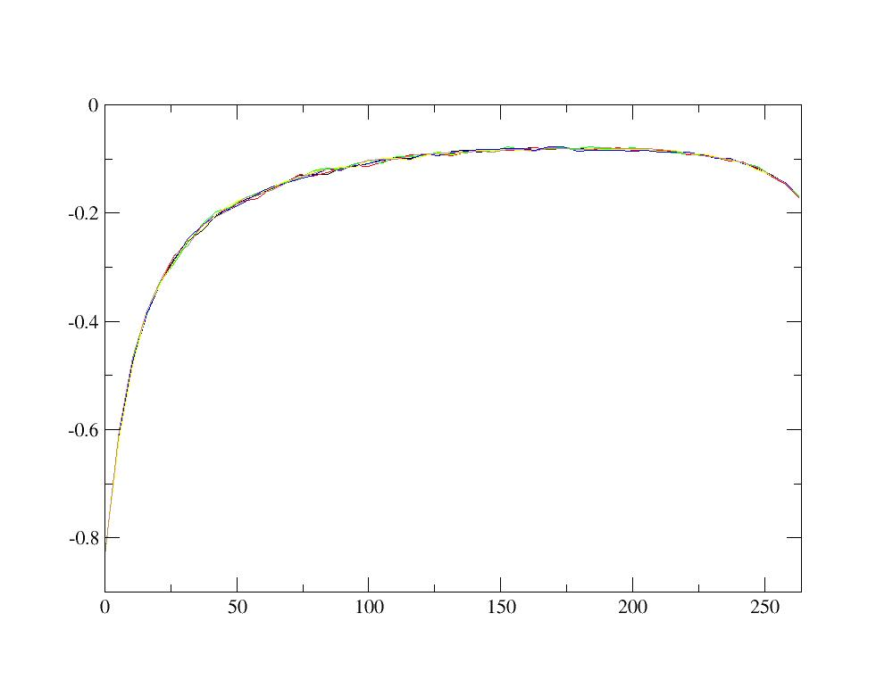
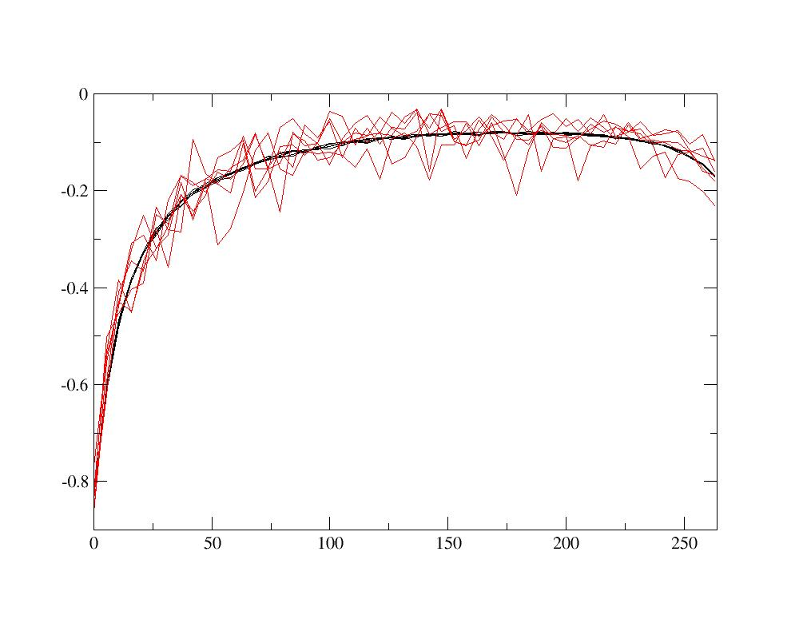
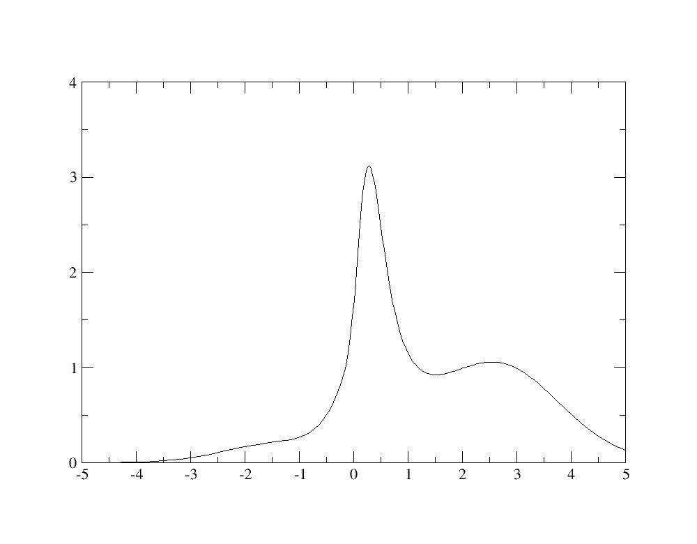
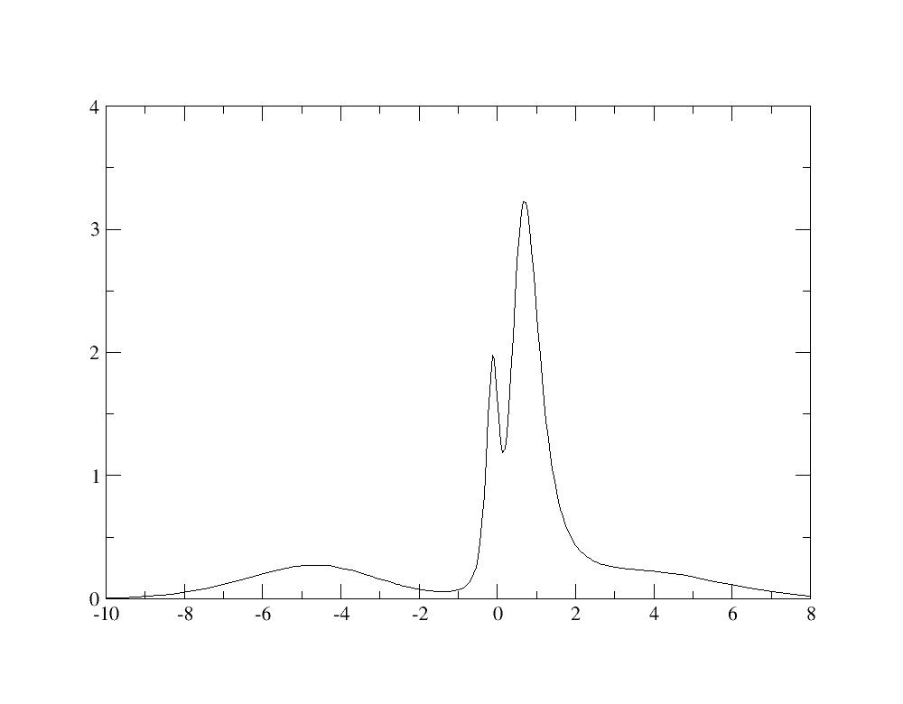
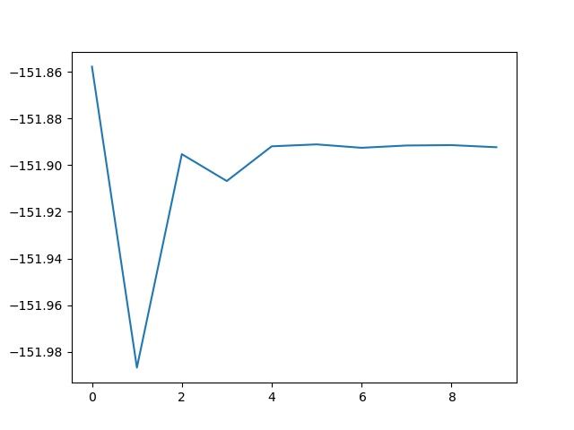
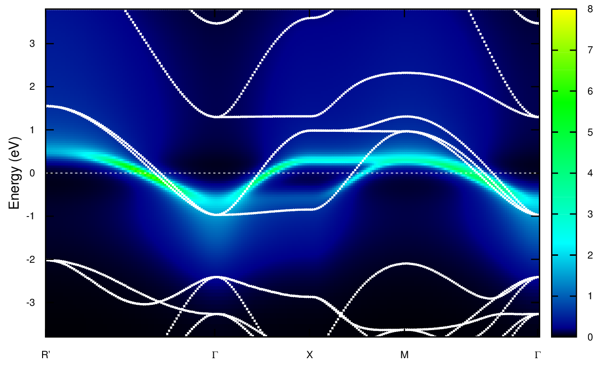

# Tutorial on DFT+DMFT

## A DFT+DMFT calculation for SrVO<sub>3</sub>.

This tutorial aims at showing how to perform a DFT+DMFT calculation using Abinit.

You will not learn here what is DFT+DMFT. But you will learn how to do a
DFT+DMFT calculation and what are the main input variables controlling this
type of calculation.

It might be useful that you already know how to do PAW calculations using
ABINIT but it is not mandatory (you can follow the two tutorials on PAW in
ABINIT, [PAW1](paw1) and [PAW2](paw2).
Also the [DFT+U tutorial](dftu) in ABINIT might be useful to know some basic
variables common to DFT+_U_ and DFT+DMFT.

This tutorial should take about one hour to complete
(less if you have access to several processors).

[TUTORIAL_READMEV9]

## 1 The DFT+DMFT method: summary and key parameters

The DFT+DMFT method aims at improving the description of strongly correlated systems.
Generally, these highly correlated materials contain rare-earth
metals or transition metals, which have partially filled *d* or *f* bands and thus localized electrons.
For further information on this method, please refer
to [[cite:Georges1996]] and [[cite:Kotliar2006]]. For an introduction to Many Body
Physics (Green's function, Self-energy, imaginary time, and Matsubara frequencies),
see e.g. [[cite:Coleman2015]] and [[cite:Tremblay2017]].

Several parameters (both physical and technical) needs to be discussed for a DFT+DMFT calculation.

  * The definition of correlated orbitals. In the ABINIT DMFT implementation, it is done with the help of
    Projected Wannier orbitals (see [[cite:Amadon2008]]). The first part of the tutorial explains the importance of this choice.
    Wannier functions are unitarily related to a selected set of Kohn Sham (KS) wavefunctions, specified in ABINIT
    by band index [[dmftbandi]], and [[dmftbandf]].
    Thus, as empty bands are necessary to build Wannier functions, it is required in DMFT calculations that the KS Hamiltonian
    is correctly diagonalized: use high values for [[nnsclo]], and [[nline]] for DMFT calculations and preceding DFT calculations.
    Roughly speaking, the larger dmftbandf-dmftbandi is, the more localized is the radial part of the orbital.
    Note that this definition is different from the definition of correlated orbitals in the DFT+_U_ implementation in ABINIT
    (see [[cite:Amadon2008a]]). The relation between the two expressions is briefly discussed in [[cite:Amadon2012]].

  * The definition of the Coulomb and exchange interaction U and J are done as in DFT+_U_ through the variables [[upawu]] and [[jpawu]].     They could be computed with the cRPA method, also available in ABINIT. The value of U and J should in principle depend
    on the definition of correlated orbitals. In this tutorial, U and J will be seen as parameters, as in the DFT+_U_ approach.
    As in DFT+_U_, two double counting methods are available (see the [[dmft_dc]] input variable).
    Note that in version 7.10.5 (but not in later versions) [[jpawu]] = 0 is required if the density matrix
    in the correlated subspace is not diagonal.

  * The choice of the double counting correction. The current default choice in ABINIT is ([[dmft_dc]] = 1)
    which corresponds to the full localized limit.

  * The method of resolution of the Anderson model. In ABINIT, it can be the Hubbard I method ([[dmft_solv]] = 2)
    the Continuous time Quantum Monte Carlo (CTQMC) method ([[dmft_solv]]=5) or the static mean field method
    ([[dmft_solv]] = 1) equivalent to usual DFT+_U_.

  * The solution of the Anderson Hamiltonian and the DMFT solution are strongly dependent over temperature.
     So the temperature [[tsmear]] is a very important physical parameter of the calculation.

  * The practical solution of the DFT+DMFT scheme is usually presented as a double loop over first the
    local Green's function, and second the electronic local density. (cf Fig. 1 in [[cite:Amadon2012]]).
    The number of iterations of both loops are respectively given in ABINIT by keywords [[dmft_iter]] and [[nstep]].
    Other useful variables are [[dmft_rslf]] = 1 and [[prtden]] = -1 (to be able to restart the calculation from the density file).
    Lastly, one linear and one logarithmic grid are used for Matsubara Frequencies indicated by [[dmft_nwli]] and [[dmft_nwlo]]
    (Typical values are 100000 and 100, but convergence should be studied).
    A large number of information are given in the log file using [[pawprtvol]] = 3.

## 2 Electronic Structure of SrVO3 in LDA

*You might create a subdirectory of the *\$ABI_TESTS/tutoparal* directory, and use it for the tutorial.
In what follows, the names of files will be mentioned as if you were in this subdirectory*

Copy the files *tdmft_1.in* and *dmft_x.files* from *\$ABI_TESTS/tutoparal* in your Work
directory,

```sh
cd $ABI_TESTS/tutoparal/Input
mkdir Work_dmft
cd Work_dmft
cp ../tdmft_x.files .
cp ../tdmft_1.in .
```



Then edit the *tdmft_x.files* and run ABINIT with:

    mpirun -n 32 abinit < tdmft_x.files > log_1 &

This run should take some time. It is recommended that you use at least 10
processors (and 32 should be fast). It calculates the LDA ground state of
SrVO3 and compute the band structure in a second step.

The variable [[pawfatbnd]] allows to create files with "fatbands" (see description of the
variable in the list of variables): the width of the line along each k-point
path and for each band is proportional to the contribution of a given atomic
orbital on this particular Kohn Sham Wavefunction. A low cutoff and a small
number of k-points are used in order to speed up the calculation.

During this time you can take a look at the input file. There are two datasets. The first
one is a ground state calculations with [[nnsclo]]=3 and [[nline]]=3 in order
to have well diagonalized eigenfunctions even for empty states. In practice,
you have however to check that the residue of wavefunctions is small at the
end of the calculation. In this calculation, we find 1.E-06, which is large
(1.E-10 would be better, so nnsclo and nline should be increased, but it would
take more time). When the calculation is finished, you can plot the fatbands
for Vanadium and l=2. Several possibilities are available for that purpose. We
will work with the simple |xmgrace| package
(you need to install it, if not already available on your machine).

    xmgrace tdmft_1o_DS2_FATBANDS_at0001_V_is1_l0002 -par ../Input/tdmft_fatband.par

The band structure is given in eV.



and the fatbands for all Oxygen atoms and *l=1* with

    xmgrace tdmft_1o_DS2_FATBANDS_at0003_O_is1_l0001 tdmft_1o_DS2_FATBANDS_at0004_O_is1_l0001 tdmft_1o_DS2_FATBANDS_at0005_O_is1_l0001 -par ../Input/tdmft_fatband.par



In these plots, you recover the band structure of SrVO3 (see for comparison
the band structure of Fig.3 of [[cite:Amadon2008]]), and the main character of
the bands. Bands 21 to 25 are mainly _d_ and bands 12 to 20 are mainly oxygen
_p_. However, we clearly see an important hybridization. The Fermi level (at 0
eV) is in the middle of bands 21-23.

One can easily check that bands 21-23 are mainly _d-t 2g_ and bands 24-25 are
mainly _e<sub>g</sub>_: just use [[pawfatbnd]] = 2 in *tdmft_1.in* and relaunch the calculations.
Then the file *tdmft_1o_DS2_FATBANDS_at0001_V_is1_l2_m-2*,
*tdmft_1o_DS2_FATBANDS_at0001_V_is1_l2_m-1* and
*tdmft_1o_DS2_FATBANDS_at0001_V_is1_l2_m1* give you respectively the _xy_, _yz_ and
xz fatbands (ie _d-t 2g_) and *tdmft_1o_DS2_FATBANDS_at0001_V_is1_l2_m+0* and
*tdmft_1o_DS2_FATBANDS_at0001_V_is1_l2_m+2* give the _z<sup>2</sup>_ and _x<sup>2</sup>-y<sup>2</sup>_ fatbands (i.e. _e<sub>g</sub>_).

So in conclusion of this study, the Kohn Sham bands which are mainly _t<sub>2g</sub>_
are the bands 21,22 and 23.

Of course, it could have been anticipated from classical crystal field theory:
the vanadium is in the center of an octahedron of oxygen atoms, so _d_
orbitals are split in _t<sub>2g</sub>_ and _e<sub>g</sub>_. As _t<sub>2g</sub>_ orbitals are not directed
toward oxygen atoms, _t<sub>2g</sub>_-like bands are lower in energy and filled with one
electron, whereas _e<sub>g</sub>_-like bands are higher and empty.

In the next section, we will thus use the _t<sub>2g</sub>_-like bands to built Wannier
functions and do the DFT+DMFT calculation.

## 3 Electronic Structure of SrVO3: DFT+DMFT calculation


### 3.1. The input file for DMFT calculation: correlated orbitals, screened Coulomb interaction and frequency mesh

In ABINIT, correlated orbitals are defined using the projected local orbitals
Wannier functions as outlined above. The definition requires to define a given
energy window from which projected Wannier functions are constructed. We would
like in this tutorial, to apply the DMFT method on _d_ orbitals and for
simplicity on a subset of _d_ orbitals, namely _t<sub>2g</sub>_ orbitals ( _e<sub>g</sub>_ orbitals
play a minor role because they are empty). But we need to define _t<sub>2g</sub>_
orbitals. For this, we will use Wannier functions.

As we have seen in the orbitally resolved fatbands, the Kohn Sham wave
function contains a important weight of _t<sub>2g</sub>_ atomic orbitals mainly in _t
2g_-like bands but also in oxygen bands.

So, we can use only the _t<sub>2g</sub>_-like bands to define Wannier functions or also
both the _t<sub>2g</sub>_-like and _O-p_ -like bands.

The first case corresponds to the input file *tdmft_2.in*. In this case
[[dmftbandi]] = 21 and [[dmftbandf]] = 23. As we only put the electron interaction
on _t<sub>2g</sub>_ orbitals, we have to use first [[lpawu]] = 2, but also the keyword
[[dmft_t2g]] = 1 in order to restrict the application of interaction on _t<sub>2g</sub>_ orbitals.

Notice also that before launching a DMFT calculation, the LDA should be
perfectly converged, including the empty states (check nline and nnsclo in the
input file). The input file *tdmft_2.in* thus contains two datasets: the first
one is a well converged LDA calculation, and the second is the DFT+DMFT calculation.

Notice the other dmft variables used in the input file and check their meaning
in the input variable glossary. In particular, we are using [[dmft_solv]] = 5 for
the dmft dataset in order to use the density-density continuous time quantum
monte carlo (CTQMC) solver. (See [[cite:Gull2011]], as well as the ABINIT 2016
paper [[cite:Gonze2016]] for details about the CTQMC implementation in ABINIT.)
Note that the number of imaginary frequencies [[dmft_nwlo]] has to be set to
at least twice the value of [[dmftqmc_l]] (the discretization in imaginary
time). Here, we choose a temperature of 1200 K. For lower temperature, the
number of Matsubara frequencies should be higher.

Here we use a fast calculation, with a small value of the parameters,
especially [[dmft_nwlo]], [[dmftqmc_l]] and [[dmftqmc_n]].

Let's now discuss the value of the effective Coulomb interaction U ([[upawu]])
and J ([[jpawu]]). The values of U and J used in ABINIT in DMFT use the same
convention as in DFT+_U_ calculations in ABINIT (cf [[cite:Amadon2008a]]). However,
calculations in Ref. [[cite:Amadon2008]] use for U and J the usual convention for
_t 2g _ systems as found in [[cite:Lechermann2006]], Eq. 26 (see also the appendix
in [[cite:Fresard1997]]). It corresponds to the Slater integral F4=0 and we can
show that U_abinit=U-4/3 J and J_abinit=7/6 J. So in order to use U = 4 eV and
J=0.65 eV with these latter conventions (as in [[cite:Amadon2008]]), we have to use
in ABINIT: [[upawu]] = 3.13333 eV; [[jpawu]] = 0.75833 eV and [[f4of2_sla]] = 0.

Now, you can launch the calculation:

Copy the files *../Input/tdmft_2.in* and modify *tdmft_x.files* in your Work
directory and run ABINIT:

    mpirun -n 32 abinit < tdmft_x.files > log_2




### 3.2. The DFT+DMFT calculation: the log file

We are now going to browse quickly the log file (log_2) for this calculation.

Starting from

    =====  Start of DMFT calculation

we have first the definition of logarithmic grid for frequency, then, after:

    == Prepare data for DMFT calculation

The projection of Kohn Sham wavefunctions and (truncated) atomic orbitals are
computed (Eq.(2.1) in [[cite:Amadon2012]]) and unnormalized orbitals are built
(Eq.(2.2) in [[cite:Amadon2012]]) The occupation matrix in this orbital basis is

      ------ Symetrised Occupation

            0.11142  -0.00000  -0.00000
           -0.00000   0.11142  -0.00000
           -0.00000  -0.00000   0.11142


and the Normalization of this orbital basis is

      ------ Symetrised Norm

            0.65790   0.00000   0.00000
            0.00000   0.65790   0.00000
            0.00000   0.00000   0.65790

Now, let's compare these numbers to other quantities. If the preceding LDA
calculation is converged, dmatpuopt=1 is used, and [[dmftbandi]]=1 and
[[dmftbandf]]=nband, then the above Symetrised Occupation should be exactly
equal to the occupation matrix given in the usual DFT+_U_ occupation matrix
written in the log file (with dmatpuopt=1) (see discussion in [[cite:Amadon2012]]).
In our case, we are not in this case because [[dmftbandi]]=21 so this
condition is not fulfilled. Concerning the norm if these orbitals, two factors play a role:

  * Firstly, the number of Kohn Sham function used should be infinite (cf Eq. B.4 of [[cite:Amadon2012]]),
    which is not the case here, because we take into account only bands 21-23.
    We emphasize that it is not a limitation of our approach, but just a physical choice concerning Wannier functions.
    This physical choice induces that these intermediate wave functions have a very low norm.

  * Secondly, the atomic orbitals used to do the projection are cut at the PAW radius.
    As a consequence, even if we would use a complete set of KS wavefunctions and thus the closure relation,
    the norm could not be one. In our case, it could be at most 0.86852, which is the norm of the
    truncated atomic function of _d_ orbitals of Vanadium used in this calculation.
    This number can be found in the log file by searching for ph0phiint (grep "ph0phiint(icount)= 1" log_2).
    (See also the discussion in Section B.3 of [[cite:Amadon2012]]).

Next the LDA Green's function is computed.

     =====  LDA Green Function Calculation

Then the Green's function is integrated to compute the occupation matrix.
Interestingly, the density matrix here must be equal to the density matrix
computed with the unnormalized correlated orbitals. If this is not the case,
it means that the frequency grid is not sufficiently large. In our case, we find:

            0.11143   0.00000   0.00000
            0.00000   0.11143   0.00000
            0.00000   0.00000   0.11143

So the error is very small (1.10E-5). As an exercise, you can decrease the
number of frequencies and see that the error becomes larger.

Then the true orthonormal Wannier functions are built and the Green's function
is computed in this basis just after:

     =====  LDA Green Function Calculation with renormalized psichi

The occupation matrix is now:

            0.16937   0.00000  -0.00000
            0.00000   0.16937   0.00000
           -0.00000   0.00000   0.16937

We see that because of the orthonormalization of the orbitals necessary to
built Wannier functions, the occupation matrix logically increases.

Then, after:

     =====  Define Interaction and self-energy

The Interaction kernel is computed from U and J, and the self energy is read
from the disk file (if it exists). Then, the Green's function is computed with
the self energy and the Fermi level is computed. Then the DMFT Loop starts.

     =====  DMFT Loop starts here

The log contains a lot of details about the calculation (especially if
[[pawprtvol]]=3). In order to have a more synthetic overview of the
calculation (this is especially useful to detect possible divergence of the
calculation), the following command extracts the evolution of the number of
electrons (LDA, LDA with Wannier functions, and DMFT number of electrons) as a
function of iterations (be careful, all numbers of electron are computed
differently as explained in the log file):

    grep -e Nb -e ITER log_2

Besides, during each DMFT calculation, there are one or more CTQMC calculations:

    Starting QMC  (Thermalization)

For the sake of efficiency, the DMFT Loop is in this calculation done only
once before doing again the DFT Loop (cf Fig. 1 of [[cite:Amadon2012]]). At the end
of the calculation, the occupation matrix is written and is:

              -- polarization spin component  1
            0.16843   0.00000  -0.00000
           -0.00000   0.16843  -0.00000
           -0.00000   0.00000   0.16843

We can see that the total number of electron is very close to one and it does
not change much as a function of iterations. As an output of the calculation,
you can find the self energy in file *tdmft_2o_DS2Self-omega_iatom0001_isppol1*
and the Green's function is file *Gtau.dat*.

### 3.3. The self energy

You can use the self-energy to compute the quasiparticle renormalization weight.
We first extract the first six Matsubara frequencies:

    head -n 8 tdmft_2o_DS2Self-omega_iatom0001_isppol1 > self.dat

Then we plot the imaginary part of the self-energy (in imaginary frequency):

    xmgrace -block self.dat -bxy 1:3

Then using |xmgrace|, you click on _Data_ , then on _Transformations_ and then
on _Regression_ and you can do a 4th order fit as:



The slope at zero frequency obtained is 0.82. From this number, the
quasiparticle renormalisation weight can be obtained using Z=1/(1+0.82)=0.55.

### 3.4. The Green's function for correlated orbitals

The impurity (or local) Green's function for correlated orbitals is written in
the file Gtau.dat. It is plotted as a function of the imaginary time in the
interval [0, β] where β is the inverse temperature (in Hartree). You can plot
this Green's function for the six _t<sub>2g</sub>_ orbitals using e.g xmgrace

    xmgrace -nxy Gtau.dat



As the six _t 2g _ orbitals are degenerated, the six Green's function must be
similar, within the stochastic noise. Moreover, this imaginary time Green's
function must be negative and the value of G(β) for the orbital i is equal to
the opposite of the number of electrons in the orbital i (-ni). Optionnally,
you can check how the Green's function can be a rough way to check for the
importance of stochastic noise. For example, change for simplicity the number
of steps for the DMFT calculation to 1:

    nstep2 1

and then use a much smaller number of steps for the Monte Carlo Solver such as

    dmftqmc_n 1.d3

save the previous Gtau.dat file:

    cp Gtau.dat Gtau.dat_save

Then relaunch the calculation. After it is completed, compare the new Green's
function and the old one with the previous value of [[dmftqmc_n]]. Using xmgrace,

    xmgrace -nxy Gtau.dat_save -nxy Gtau.dat

one obtains:



One naturally sees that the stochastic noise is much larger in this case. This
stochastic noise can induces that the variation of physical quantities (number
of electrons, electronic density, energy) as a function of the number of
iteration is noisy. Once you have finished this comparison, copy the saved
Green's function into Gtau.dat in order to continue the tutorial with a
precise Green's function in *Gtau.dat*:

    cp Gtau.dat_save Gtau.dat

### 3.5. The local spectral function

You can now use the imaginary time Green's function (contained in file
Gtau.dat) to compute the spectral function in real frequency. Such analytical
continuation can be done on quantum Monte Carlo data using the Maximum Entropy method.

A maximum entropy code has been published recently by D. Bergeron. It can be
downloaded [here](https://www.physique.usherbrooke.ca/MaxEnt/index.php/Main_Page).
Please cite the related paper [[cite:Bergeron2016]] if you use this code in a publication.

The code has a lot of options, and definitely, the method should be understood
and the user guide should be read before any real use. It is not the goal of
this DFT+DMFT tutorial to introduce to the Maximum Entropy Method (see
[[cite:Bergeron2016]] and references therein). We give here a very quick way to
obtain a spectral function. First, you have to install this code and the
armadillo library by following the [guidelines](https://www.physique.usherbrooke.ca/MaxEnt/index.php/Download),
and then launch it on the current directory in order to generate the default
input file *OmegaMaxEnt_input_params.dat*.

    OmegaMaxEnt

Then edit the file *OmegaMaxEnt_input_params.dat*, and modify the first seven lines with:

    data file: Gtau.dat

    OPTIONAL PREPROCESSING TIME PARAMETERS

    DATA PARAMETERS
    bosonic data (yes/[no]): no
    imaginary time data (yes/[no]): yes


Then relaunch the code

    OmegaMaxEnt

and plot the spectral function:

    xmgrace OmegaMaxEnt_final_result/optimal_spectral_function_*.dat

Change the unit from Hartree to eV, and then, you have the spectral function:



Even if the calculation is not well converged, you recognize in the spectral
functions the quasiparticle peak as well as Hubbard bands at -2 eV and +2.5 eV
as in Fig.4 of [[cite:Amadon2008]].

## 4 Electronic Structure of SrVO3: Choice of correlated orbitals

Previously, only the _t<sub>2g</sub>_-like bands were used in the definition of Wannier
functions. If there were no hybridization between _t<sub>2g</sub>_ orbitals and oxygen
_p_ orbitals, the Wannier functions would be pure atomic orbitals and they
would not change if the energy window was increased. But there is an important
hybridization, as a consequence, we will now built Wannier functions with a
large window, by including oxygen _p_ -like bands in the definition of Wannier
functions. Create a new input file:

    cp tdmft_2.in tdmft_3.in

and use [[dmftbandi]] = 12 in *tdmft_3.in*. Now the code will built Wannier
functions with a larger window, including _O-p_ -like bands, and thus much
more localized. Launch the calculation after having updated tdmft_x.files (if
the calculation is too long, you can decide to restart the second dataset
directly from a converged LDA calculation instead of redoing the LDA
calculation for each new DMFT calculation).

    abinit < tdmft_x.files > log_3

In this case, both the occupation and the norm are larger because more states
are taken into account: you have the occupation matrix which is

      ------ Symetrised Occupation

            0.23573  -0.00000  -0.00000
           -0.00000   0.23573  -0.00000
           -0.00000  -0.00000   0.23573


and the norm is:

      ------ Symetrised Norm

            0.78223   0.00000  -0.00000
            0.00000   0.78223  -0.00000
           -0.00000  -0.00000   0.78223

Let us now compare the total number of electron and the norm with the two energy window:

<center>

Energy window:                           |   _t<sub>2g</sub>_-like bands |        _t<sub>2g</sub>_-like+ _O-p_ -like bands
-----------------------------------------|-------------------------------|---------------------------------------------------
[[dmftbandi]]/[[dmftbandf]]:                     |    21/23                      | 12/23
Norm:                                    |  0.66                         |   0.78
LDA Number of electrons (before ⊥):   |  0.66(=0.11*6)                |  1.42(=0.235*6)
LDA Number of electrons (after  ⊥):   |    1.02                       |  1.81

</center>

For the large window, as we use more Kohn Sham states, both the occupation and
the norm are larger, mainly because of the important weight of _d_ orbitals in
the oxygen bands (because of the hybridization). Concerning the norm, remind
that in any case, it cannot be larger that 0.86. So as the Norm is 0.78, it
means that by selecting bands 12-23 in the calculation, we took into account
0.78/0.86*100=90\% of the weight of the truncated atomic orbital among Kohn
Sham bands. Moreover, after orthonormalization, you can check that the
difference between LDA numbers of electrons is still large (1.02 versus 1.81),
even if the orthonormalization effect is larger on the small windows case.
Note that in this particular case, with diagonal matrix, the number of
electrons before and after orthonormalization are simply linked by
n_before/Norm=n_after, i.e. 1.81 ≈1.42/0.78 and 1.02≈0.66/0.66

At the end of the DFT+DMFT calculation, the occupation matrix is written and is

              -- polarization spin component  1
            0.29450   0.00000   0.00000
            0.00000   0.29450   0.00000
            0.00000   0.00000   0.29450

Similarly to the previous calculation, the spectral function can be plotted
using the Maximum Entropy code: we find a spectral function with an
hybridation peak at -5 eV, as described in Fig.5 of [[cite:Amadon2008]].



Resolving the lower Hubbard bands would require a more converged calculation.

As above, one can compute the renormalization weight and it gives 0.68. It
shows that with the same value of U and J, interactions have a weaker effect
for the large window Wannier functions. Indeed, the value of the screened
interaction U should be larger because the Wannier functions are more
localized (see discussion in [[cite:Amadon2008]]).

## 5 Electronic Structure of SrVO3: The internal energy

The internal energy can be obtained with

    grep -e ITER -e Internal log_3

and select the second occurrence for each iteration (the double counting
expression) which should be accurate with iscf=17 (at convergence both
expressions are equals also in DFT+DMFT). So after gathering the data:

<center>

 Iteration |     Internal Energy (Ha)
-----------|--------------------------
      1    |  -1.51483736718814E+02
      2    |  -1.51480860837124E+02
      3    |  -1.51479980721122E+02
      4    |  -1.51479456233951E+02
      5    |  -1.51479511038784E+02
      6    |  -1.51479570943715E+02
      7    |  -1.51479487485907E+02
      8    |  -1.51479539558451E+02
      9    |  -1.51479457525225E+02
     10    |  -1.51479582334490E+02

</center>

You can plot the evolution of the internal energy as a function of the iteration.



You notice that the internal energy (in a DFT+DMFT calculations) does not
converge as a function of iterations, because there is a finite statistical
noise. So, as a function of iterations, first, the internal energy starts to
converge, because the modification of the energy induced by the self-
consistency cycle is larger than the statistical noise, but then the internal
energy fluctuates around a mean value. So if the statistical noise is larger
than the tolerance, the calculation will never converge. So if a given
precision on the total energy is expected, a practical solution is to increase
the number of Quantum Monte Carlo steps ([[dmftqmc_n]]) in order to lower the
statistical noise. Also another solution is to do an average over the last
values of the internal energy. Note that in version 7.10.5, only the Internal
energy has a physical meaning in DFT+DMFT and not Etotal or ETOT.

## 6 Electronic Structure of SrVO3 in DFT+DMFT: Equilibrium volume

We focus now on the total energy. Create a new input file, *tdmft_4.in*:

    cp tdmft_3.in tdmft_4.in

And use [[acell]] = 7.1605 instead of 7.2605. Relaunch the calculation and note the
Internal energy (grep Internal tdmft_4.out).

Redo another calculation with [[acell]] = 7.00. Then extract the LDA Internal energy
and the DMFT Internal energy (grep Internal tdmft_5.out).

<center>

acell  | Internal energy LDA  |  Internal energy DMFT
-------|----------------------|-------------------------
7.0000 |  -151.51517          |     -151.4797
7.1605 |  -151.52399          |     -151.4877
7.2605 |  -151.51515          |     -151.4795

</center>

and then plot DMFT and LDA energies as a function of acell. You will notice
that the equilibrium volume is very weakly modified by the strong correlations is this case.

## 7 Electronic Structure of SrVO3: k-resolved Spectral function

We are going to use OmegaMaxEnt to do the direct analytical continuation of the self-energy in Matsubara frequencies to real frequencies.
(A more precise way to do the analytical continuation uses an auxiliary Green's function as mentionned in e.g. endnote 55
of Ref. [[cite:Sakuma2013a]]).
First of all, we are going to relaunch a more converged calculation using tdmft_5.in



Modify tdmft_x.files and launch the calculation, it might take some time. The calculation takes in few minutes with 4 processors.

    abinit < tdmft_x.files > log_5

We are going to create a new directory for the analytical continuation.

    mkdir Spectral
  
We first extract the first Matsubara frequencies (which are not too noisy)
    
    head -n 26 tdmft_5o_DS2Selfrotformaxent0001_isppol1_iflavor0001 > Spectral/self.dat

In this directory, we launch OmegaMaxEnt just to generate the input template:

    cd Spectral
    OmegaMaxEnt

Then, you have to edit the input file *OmegaMaxEnt_input_params.dat* of OmegaMaxent and specify that the data is contained in self.dat and
that it contains a finite value a infinite frequency. So the first lines should look like this:

    data file: self.dat
    
    OPTIONAL PREPROCESSING TIME PARAMETERS
    
    DATA PARAMETERS
    bosonic data (yes/[no]):
    imaginary time data (yes/[no]):
    temperature (in energy units, k_B=1):
    finite value at infinite frequency (yes/[no]): yes


Then relaunch OmegaMaxent

    OmegaMaxEnt

You can now plot the imaginary part of the self energy in real frequencies with (be careful, this file contains in fact -2 Im$\Sigma$. If another analytical continuation tool is used, one needs to give to ABINIT -2 Im$\Sigma$ and not $\Sigma$ ):

    xmgrace OmegaMaxEnt_final_result/optimal_spectral_function.dat

Then, we need to give to ABINIT this file in order for abinit to use
it, to compute the Green's function in real frequencies and to deduce the k-resolved spectral function.
First copy this self energy in the real axis in a Self energy file and a grid file for ABINIT.

    cp OmegaMaxEnt_final_result/optimal_spectral_function.dat ../self_ra.dat
    cd ..

Create file containing the frequency grid with:

    wc -l self_ra.dat >  tdmft_5o_DS3_spectralfunction_realfrequencygrid
    cat self_ra.dat >> tdmft_5o_DS3_spectralfunction_realfrequencygrid

As in this particular case, the three self energies for the three t2g orbitals are equal,
we can do only one analytical continuation, and duplicate the results as in:

    cp self_ra.dat  tdmft_5i_DS3Self_ra-omega_iatom0001_isppol1
    cat self_ra.dat >>  tdmft_5i_DS3Self_ra-omega_iatom0001_isppol1
    cat self_ra.dat >>  tdmft_5i_DS3Self_ra-omega_iatom0001_isppol1

Now, tdmft_5i_DS3Self_ra-omega_iatom0001_isppol1 file, contains three times the self
real axis self-energy. If the three orbitals were not degenerated, one would have of course to use
a different real axis self-energy for each orbitals (and thus do an analytical continuation for each).

Copy the file containing the rotation of the self energy in the local basis (useful for non cubic cases, here
this matrix is just useless):

    cp tdmft_5o_DS2.UnitaryMatrix_for_DiagLevel_iatom0001 tdmft_5i_DS3.UnitaryMatrix_for_DiagLevel_iatom0001 

Copy the Self energy in imaginary frequency for restart also (dmft_nwlo should be the same in the input
file  tdmft_5.in and tdmft_2.in)

    cp tdmft_5o_DS2Self-omega_iatom0001_isppol1 tdmft_5o_DS3Self-omega_iatom0001_isppol1
    

Then modify tdmft_5.in with

    ndtset 1
    jdtset 3
    
and relaunch the calculation.

    abinit < tdmft_x.files > log_5_dataset3


Then the spectral function is obtained in file tdmft_5o_DS3_DFTDMFT_SpectralFunction_kresolved_from_realaxisself. You can copy
it in file bands.dat:

    cp tdmft_5o_DS3_DFTDMFT_SpectralFunction_kresolved_from_realaxisself bands_dmft.dat

Extract DFT band structure from fatbands file in readable file for gnuplot (261 is the number
of k-point used to plot the band structure (it can be obtained by "grep nkpt log_5_dataset3"):

    grep " BAND" -A 261 tdmft_5o_DS3_FATBANDS_at0001_V_is1_l0001 | grep -v BAND > bands_dft.dat

And you can use a gnuplot script to plot it:



    gnuplot
    
    	G N U P L O T
    	Version 5.2 patchlevel 7    last modified 2019-05-29 
    
    	Copyright (C) 1986-1993, 1998, 2004, 2007-2018
    	Thomas Williams, Colin Kelley and many others
    
    	gnuplot home:     http://www.gnuplot.info
    	faq, bugs, etc:   type "help FAQ"
    	immediate help:   type "help"  (plot window: hit 'h')
    
    Terminal type is now 'qt'
    gnuplot> load "../tdmft_gnuplot"


The spectral function should thus look like this.



The white curve is the LDA band structure, the colored plot is the DMFT spectral function.
One notes the renormalization of the bandwith as well as Hubbard bands, mainly visible a high energy  (arount 2 eV).
A  more precise description of the Hubbard band would require a more converged calculation.


## 8 Electronic Structure of SrVO3: Conclusion
  
To sum up, the important physical parameters for DFT+DMFT are the definition
of correlated orbitals, the choice of U and J (and double counting). The
important technical parameters are the frequency and time grids as well as the
number of steps for Monte Carlo, the DMFT loop and the DFT loop.

We showed in this tutorial how to compute the correlated orbital spectral functions, quasiparticle
renormalization weights, total internal energy and the k-resolved spectral function.
