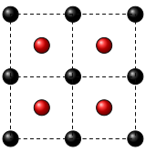
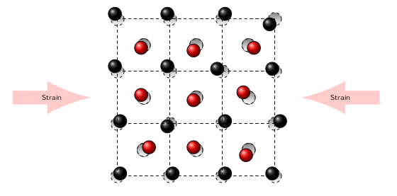

# First tutorial on MULTIBINIT

## Build a harmonic lattice model and run a dynamics

This lesson aims at showing how to build a harmonic model by using a second-principles approach
for lattice dynamics simulations based on atomic potentials fitted on first-principles calculations.

**Before beginning, it is very important to read the reference [[cite:Wojdel2013]].**

With this lesson, you will learn to:

  * Compute the model from the DDB
  * Generate the XML for the model
  * Run a dynamics within MULTIBINIT

In this tutorial, all the knowledge about the Density Functional Theory (DFT) and Density Functional Perturbation Theory (DFPT) should have been already acquired.
In addition, the DFPT is a key feature of ABINIT for MULTIBINIT thus, in order to learn how to use the DFPT (producing the related DDB) and the associated code to merge different DDB files,
please have a look at the tutorials on [[lesson:rf1| Phonon response]], [[lesson:elastic|strain response]] and [[lesson:rf2| Mrgddb]] before to continue.
After these tutorials you should be able to compute a full DFPT calculation and a complete DDB file.
Thereby this tutorial will not provide the inputs for ABINIT, that you can find, however, in the previously cited tutorials.

The AGATE software, used to make the analysis of the results, is also required for this tutorial. You can install it on debian with:

    sudo add-apt-repository ppa:piti-diablotin/abiout
    sudo apt-get update && sudo apt-get install abiout

[TUTORIAL_README]

## 1 The Harmonic part of the lattice model

As described in [[cite:Wojdel2013]], the construction of a model starts by defining the reference structure (RS) of the system under study:

: Fig. 1: Example of cubic RS made by two different (black and red) atomic species.

The choice of this RS is fundamental since the model will be based on perturbations acting on it.
Once this choice is done, make sure than your system is fully relaxed and perform a single DFT calculation on this system in order to generate a DDB file.
In this tutorial, we will take as an example of a material without instabilities, the perovskite CaTiO3 in the Pnma phase.

From the RS, now we consider the perturbations: the set of atomic displacements $\boldsymbol{u}$ and lattice strain $\boldsymbol{\eta}$:

: Fig. 2: Example of lattice perturbations: atomic displacements and strain.

At **the harmonic level**, we can express the potential energy as a sum of three contributions as a function of the set of perturbations ($\boldsymbol{u}$, $\boldsymbol{\eta}$):

$$\displaystyle  E^{harm}(\boldsymbol{u},\boldsymbol{\eta}) =  E^{harm}(\boldsymbol{u}) + E^{harm}(\boldsymbol{u},\boldsymbol{\eta}) + E^{harm}(\boldsymbol{\eta})$$

This calculation requires:

  * the computation of the phonon response (including short range and dipole-dipole interactions):

$$\displaystyle  E^{harm}(\boldsymbol{u}) \Longrightarrow \underbrace{\frac{\partial^2 E}{\partial
          \boldsymbol{u}^2}}_{\substack{\text{Inter-atomic}\\\text{force constants}}} ,
     \underbrace{\frac{\partial^2 E}{\partial
          {\boldsymbol{\cal{E}}}^2}}_{\text{Dielectric tensor}} ,
     \underbrace{\frac{\partial^2 E}{\partial{\boldsymbol{\cal{E}}} \partial \boldsymbol{u}}}_{\text{Effective charges}} $$

  * the computation of the strain response:
$$\displaystyle  E^{harm}(\boldsymbol{\eta}) \Longrightarrow \underbrace{\frac{\partial^2 E}{\partial
            \boldsymbol{\eta}^2}}_{\text{Elastic constants}} $$

  * the computation of the strain-phonon coupling:
$$\displaystyle E^{harm}(\boldsymbol{u},\boldsymbol{\eta}) \Longrightarrow \underbrace{\frac{\partial^2
            E}{\partial\boldsymbol{\eta}\partial\boldsymbol{u}}}_{\substack{\text{Internal strain}}} $$

We note that all the needed quantities related to the harmonic part can be computed by using the [[topic:DFPT|DFPT]] method and, once obtained, they are stored in a database (DDB) file.
In the case of an *insulator*, the dipole-dipole interaction will be recomputed directly by MULTIBINIT.
Thereby you need to provide into the DDB file the clamped-ion dielectric tensor and the Born effective charges.

!!! note

    Do not forget to include in the final DDB file the DDB obtained from the RS single DFT calculation (you can still use [[help:mrgddb | Mrgddb]]). Indeed, the DDB file is also an output of a DFT calculation and, in order to build of a model, it is important to include it in the DDB file to be used.

In this tutorial, we will take as an example of a material without lattice instabilities: the perovskite CaTiO$_3$ in its $Pnma$ phase.

*Optional exercise $\Longrightarrow$ Compute the phonon band structure with [[help:anaddb|Anaddb]]. You can download the complete DDB file (resulting from the previous calculations) here:*


**Before starting, you might to consider working in a different subdirectory than for the other lessons. Why not create "Work_latticeModel"?**

The file ~abinit/tests/tutomultibinit/Input/tmulti1_1.files lists the file names and root names.
You can copy it in the **Work_latticeModel** directory and look at this file content, you should see:

      tutomulti1_1.abi
      tutomulti1_1.abo
      tmulti1_DDB

As mentioned in the guide of [[help:multibinit | MULTIBINIT]]:

   * "tutomulti1_1.abi" is the main input file
   * "tutomulti1_1.abo" is the main output
   * "tmulti1_DDB" is the DDB which contains the system definition and the list of the energy derivatives

It is now time to copy the file ~abinit/tests/tutomultibinit/Input/tmulti1_DDB and ~abinit/tests/tutomultibinit/Input/tmulti1_DDB in your **Work_latticeModel** directory.
You should read carefully the input file:



You should now run (it would take less than a second):

    multibinit < tmulti1_1.files > tmulti1_1_stdout

The resulting output file, tmulti1_1.abo, should be similar to the one below.


The run you performed was aimed at reading the DDB file, generating the short range interatomic force constants and extract all the other informations related to the harmonic part of the model.
You can find inside the output file, the Born effective charges, the clamped-ion elastic tensor and the internal strain coupling parameters. Take some time to open and read the tmulti1_1.abo file.
If the DDB file is complete, the generation of the XML file requires only few input variables:

   * [[multibinit:prt_model]] = 1 $\Longrightarrow$ the generation of the XML file is activated, takes the time to read the possible options for [[multibinit:prt_model]].
   * [[multibinit:ngqpt]]    = 2 2 2 $\Longrightarrow$ specified the q-point mesh included in the tmulti1_DDB file
   * [[multibinit:dipdip]]   = 0 $\Longrightarrow$  it disables the computation of the dipole-dipole interaction: we don''t need to compute it to generate the XML file, MULTIBINIT will be able to regenerate the dipole-dipole interaction in a next run. We remind you that the default for this option is 1 and in the most part of your runs you will not use this option.

After this run, you should see in your directory tmulti1_1_model.xml, you can take some time to open and read this file. As you can see, it contains all the informations about the system definition (lattice parameters, atomic positions) and the data for the harmonic part of the potential.

Your XML file is now ready and you can use it as input for MULTIBINIT. To do that, copy now in your work directory the file ~abinit/tests/tutomultibinit/Input/tmulti1_2.files; you should see inside it:

      tutomulti1_2.abi
      tutomulti1_2.abo
      tmulti1_1_model.xml

Here, the DDB file is replaced by the XML file. Do not forget to copy the ~abinit/tests/tutomultibinit/Input/tutomulti1_2.abi in your directory before you run:

    multibinit < tmulti1_2.files > tmulti1_2_stdout

In tutomulti1_2.abi, [[multibinit:prt_model]] is still set to one so multibinit will write again the model XML file, which is useless at this stage, being a copy of the one read as input. Set this input variable to 0 and, in this case, MULTIBINIT will just read (and not write) the XML file.

With the two last examples, we have shown that MULTIBINIT is able to read either a DDB file or a XML as inputs for the system definition and the harmonic part of the potential.

We can now run our *first dynamics*: you can copy the files ~abinit/tests/tutomultibinit/Input/tutomulti1_3.* in your work directly and have a look them.



The simulation starts from the DDB to correctly account for the dipole-dipole interactions. You can visualize your dynamics with the agate software:

    agate tmulti1_3.abo_HIST.nc

Also try to use the effective potential from the xml file instead, in which the dipole-dipole interactions were not corrected. What do you see when you visualize the track?

* * *

This MULTIBINIT tutorial is now finished.
